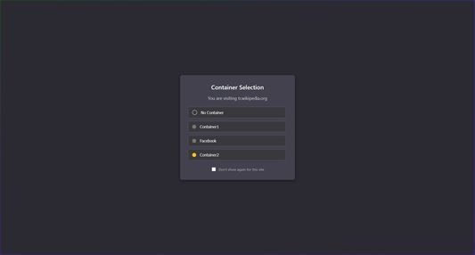
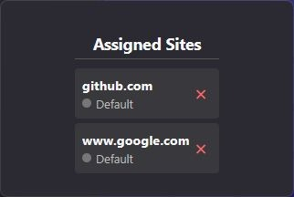

# Container Interceptor 📦

  

  

**Container Interceptor** is a powerful extension for Firefox that enhances your experience with Multi-Account Containers. It gives you full control over which container a website opens in, allowing you to isolate your online identities, separate work from personal browsing, and improve your privacy.

Whether you want to permanently assign a site to a specific container or choose on-the-fly as you browse, Container Interceptor has you covered.

---

## 🚀 Key Features

This extension supercharges the standard container functionality with the following capabilities:

### 1. Dynamic Container Selection (The Interceptor)
Never accidentally open a site in the wrong context again.
* **Instant Interception:** When you navigate to a new domain, Container Interceptor pauses the request and presents a beautiful, dark-themed popup asking you to choose the appropriate container.
* **Smart Context:** The popup clearly shows which site you are visiting.
* **Remember My Choice:** Easily convert your one-time selection into a permanent rule by checking the "Don't show again for this site" box.

  
   
  <em>The interception popup allows for quick container selection on navigation.</em>

### 2. Permanent Site Assignment
Build a personalized web browsing environment by assigning specific domains to dedicated containers.
* **Automatic Routing:** Once a site is assigned to a container, it will *always* open there.
* **Visual Management:** Easily view and manage your assigned sites through the extension's popup. Remove assignments with a single click.

  
   
  <em>Manage your permanently assigned sites from a simple interface.</em>

### 3. Privacy & Isolation
By effectively using containers, you gain significant privacy benefits:
* **Cookie Isolation:** Cookies, cache, and local storage are isolated within each container.
* **Tracker Blocking:** Prevents social networks and advertising companies from tracking your browsing activity across different websites.

---

## 📸 Screenshots

| Container Selection | Assigned Sites Management |
| :---: | :---: |
|  |  |

---

## 🛠️ Installation

### From Source (For Developers)
To test the latest changes:

1.  Clone this repository or download the source code.
2.  Open Firefox and navigate to `about:debugging#/runtime/this-firefox`.
3.  Click the **"Load Temporary Add-on..."** button.
4.  Select the `manifest.json` file within the extension folder.

---

## ⚙️ How to Use

### Assigning a Site on First Visit
1.  Navigate to a website you haven't visited before.
2.  The **Container Selection** popup will appear before the page loads.
3.  Select the desired container from the list.
4.  To make this permanent, check the **"Don't show again for this site"** box.

### Managing Assignments
1.  Click the Container Interceptor icon in your browser toolbar.
2.  You will see a list of **"Assigned Sites"**.
3.  To remove an assignment, click the red **"X"** next to the domain name.

---

## 🛡️ Permissions & Privacy

Container Interceptor requires the following permissions to function correctly. **Your browsing data never leaves your machine.**

* `contextualIdentities`: Necessary to list your existing containers and open tabs within them.
* `tabs`: Used to detect navigation events and redirect tabs to the correct container.
* `webRequest` & `webRequestBlocking`: The core permission that allows the extension to intercept a navigation request *before* it happens.
* `storage`: Used to securely save your site assignments locally.

---

## 📝 License

This project is licensed under the [MIT License](LICENSE).
